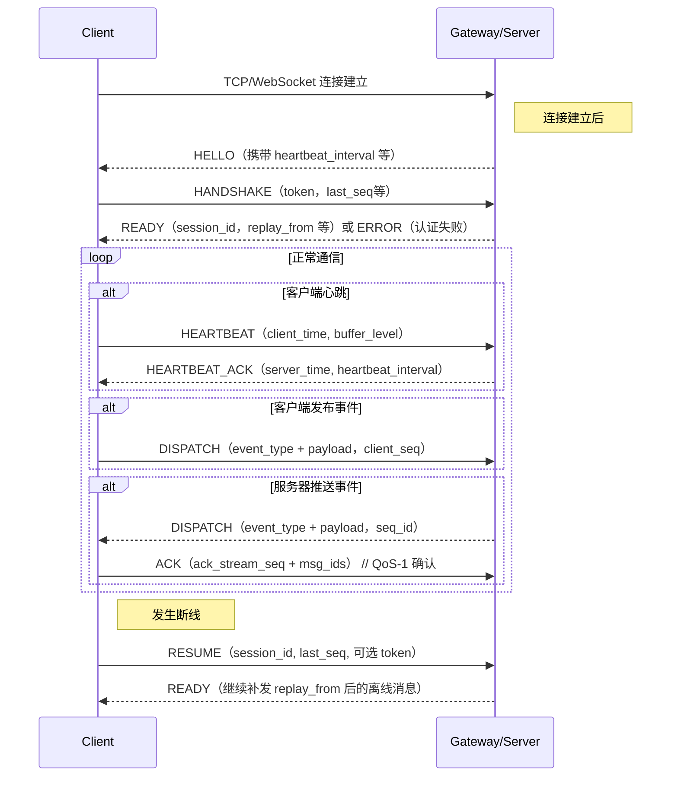

设计目标

只提供一个 connect 接口，所有的操作都在这一个 connect 中完成

消息进入流：
client -> gateway -> kafka -> business

消息返回流：
business -> kafka -> gateway -> client (主)
business -> gateway api -> client（辅控制 control）

消息数据流走 MQ
连接/session 控制走 Gateway API

## 控制面 和 业务面

1. 控制面与业务面必须分离
2. gateway 服务只服务于控制面，业务面只能有一个

heartbeat 心跳请求（Client → Gateway）
heartbeat_ack 心跳确认（Gateway → Client）

handshake 认证请求（Client → Gateway）

presence 在线状态更新/Presence（Client → Gateway）

resume 恢复连接（Client → Gateway）

reconnect 服务端要求重连（Gateway → Client）

subscribe 订阅房间/Topic/群组（Client → Gateway）

unsubscribe 取消订阅（Client → Gateway）

error 无效会话（Gateway → Client）

kick 踢人（Gateway → Client）

ack 消息确认（Client → Gateway，QoS-1）

dispatch 消息分发（Client → Gateway）业务事件（上/下行都走这个 opcode）

## 长连接网关的典型场景：
- 握手/认证/心跳（控制面）
- 单聊/群聊（IM）
- 房间/广播（Live）
- 推送（Push）
- 系统通知/公告
- 在线状态/Presence
- 消息撤回/编辑/已读
- 限流/降级/踢人
- 多设备同步
- 消息重放/离线补发
- 订阅/取消订阅（Room/Topic）
- 批量消息
- 文件/媒体传输信令
- 实时音视频信令
- 分布式一致性（如跨房间广播协调）

长连接网关的典型业务需求：
1. 即时通讯（IM）：单聊、群聊、已读、撤回、输入状态
2. 直播（Live）：弹幕、礼物、点赞、进出房间、连麦
3. 推送（Push）：系统通知、营销推送、静默推送
4. 实时数据：股票行情、游戏状态、IoT 数据
5. 在线状态：用户上线/下线/隐身
6. 订阅：房间订阅、Topic 订阅、群组订阅
7. 信令：音视频通话、屏幕共享、白板

## 其他
FrameType 的设计需要考虑：
1. 快速分发：网关需要基于 FrameType 做 O(1) 的 handler 路由
2. 优先级：控制帧（PING/ACK）需要优先于业务帧
3. 统计：按 FrameType 做 metrics 分组
4. 限流：可以对某些 FrameType 单独限流（如 IM_TYPING 频率远高于 IM_CHAT）
5. 安全：某些 FrameType 只能在认证后使用

