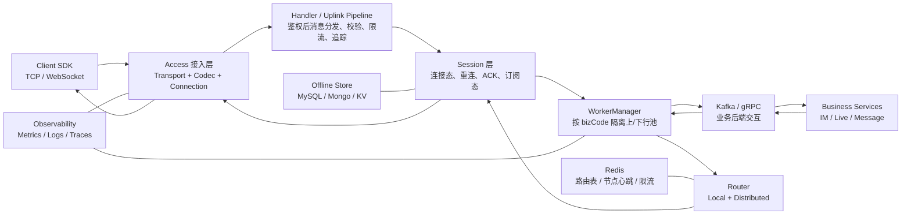
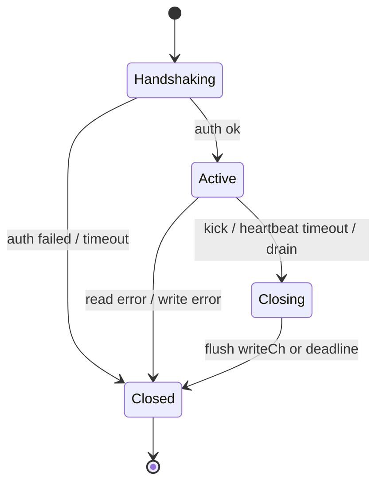
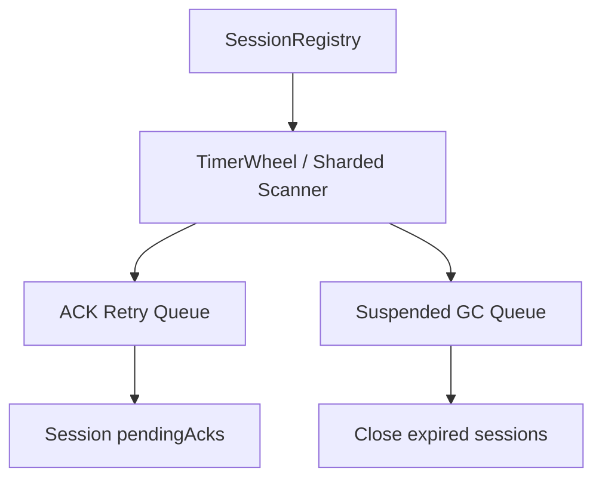
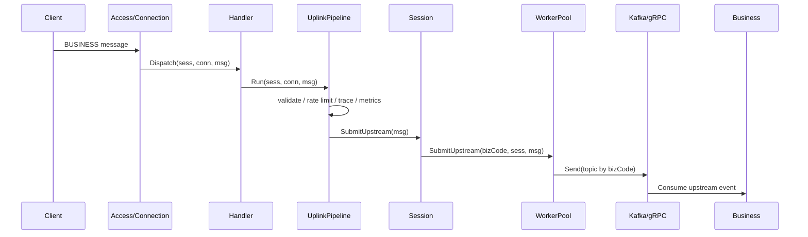
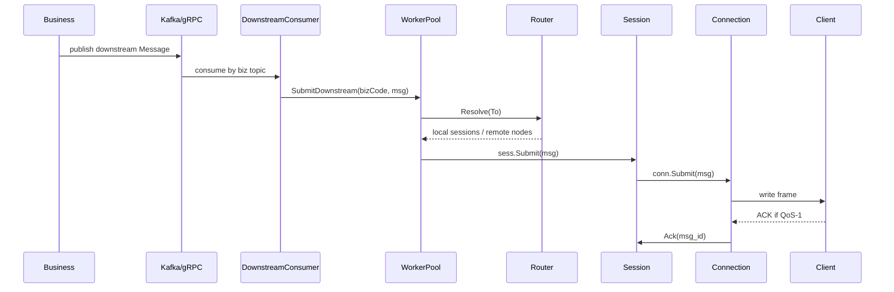

# long-gw Gateway 生产化重构架构设计文档

> 范围：本文档基于 `gateway` 目录当前实现，面向 IM、Live、Message/Push 等长连接常见业务，给出可分阶段执行的生产开发架构与重构计划。目标是支撑公司级百万长连接业务，并为后续千万连接、多地域、多租户演进预留边界。

## 1. 背景与目标

`gateway` 当前已经具备长连接网关雏形：TCP/WebSocket 接入、握手鉴权、连接双 goroutine、Session 抽象、本地路由、Redis 分布式路由、WorkerPool 隔离、Kafka 上下行、Prometheus 指标、Helm 部署模板等。代码主要分布在：

- 接入层：`internal/access/*`
- 会话层：`internal/session/*`
- 路由层：`internal/router/*`
- 上下行流水线：`internal/pipeline/*`
- Worker 层：`internal/worker/*`
- 启动编排：`internal/app/*`
- 配置与依赖：`internal/config/*`、`internal/svc/*`

本次重构不推翻现有方向，而是把已有雏形收敛为生产可开发、可扩容、可观测、可压测验证的长连接网关架构。

### 1.1 核心目标

| 目标 | 说明 |
| --- | --- |
| 百万连接 | 单集群百万级长连接，单节点容量由压测确定，目标单节点 10 万～50 万连接起步演进 |
| 多业务隔离 | 支持 `im`、`live`、`message` 等业务域独立限流、Worker、Topic、QoS 策略 |
| 稳定接入 | 支持 TCP/WebSocket，预留 QUIC/gRPC 内部推送扩展点 |
| 可靠投递 | 支持 QoS-0、QoS-1、离线消息、ACK、断线重连、序号重放 |
| 分布式路由 | 支持用户、设备、房间、Topic 的本地与跨节点投递 |
| 生产治理 | 支持优雅上下线、限流、背压、熔断、可观测、压测、容量规划 |
| 演进友好 | 以接口分层和模块边界保证业务接入、协议扩展、存储替换低成本 |

### 1.2 非目标

- 不在 Gateway 内实现 IM 群关系、直播房间权限、消息内容审核等业务逻辑。
- 不让 Gateway 成为强状态业务中心；Gateway 只保存连接态、路由态、轻量订阅态和必要投递态。
- 不保证所有 Live 弹幕可靠落库；Live 默认 QoS-0，弱可靠、低延迟优先。

## 2. 当前实现诊断

### 2.1 已有基础

| 能力 | 当前位置 | 评价 |
| --- | --- | --- |
| TCP/WebSocket 接入 | `internal/access/tcp`、`internal/access/websocket` | 具备统一 `Transport` 抽象 |
| 连接双 goroutine | `internal/access/connruntime` | 读写分离方向正确 |
| 握手鉴权 | `connruntime.Factory`、`access/handler` | 已有 AuthVerifier，但超时、失败码、缓存待增强 |
| Session 抽象 | `internal/session` | 已有重连、订阅恢复、pending ACK 设计 |
| 本地路由 | `internal/router/local.go` | 已有 user/room/topic 索引雏形 |
| Redis 路由 | `internal/router/distributed.go` | 有用户/设备路由 TTL，但缺心跳刷新、节点元数据和跨节点投递闭环 |
| WorkerPool | `internal/worker` | 有业务域隔离设计，但启动、容量配置、背压策略需补全 |
| 上下行 Pipeline | `internal/pipeline` | 抽象清晰，但限流、指标、过滤策略仍需生产化 |
| 离线存储 | `internal/worker/storage` | 有 MySQL 模型，但序列化、用户字段、分页、幂等待实现 |
| 部署 | `deploy/helm` | 有基础 Helm，但 readiness、drain、资源参数需补齐 |

### 2.2 生产化断点

| 优先级 | 问题 | 影响 |
| --- | --- | --- |
| P0 | `Connection.Close` 空实现 | 踢人、心跳超时、优雅关闭无法可靠释放连接 |
| P0 | `workerManager.StartAll` 未在启动流程中调用 | 上下行 Worker 可能未运行 |
| P0 | `adminHandler` 初始化被注释 | HTTP 管理接口可能空指针 |
| P0 | `ServiceContext.newRedis` 判断逻辑疑似反向 | Redis 路由可能无法初始化 |
| P0 | `SessionDeps.Worker` 未注入 | 上行 `SubmitUpstream` 可能无法工作 |
| P0 | LocalRouter `Resolve` 与注释中的 `u:/r:/t:` 语义不一致 | 业务投递目标解析容易错投/漏投 |
| P0 | Kafka 上行 Sender 未携带完整 Message，且 `Async=true` 下错误不可感知 | 上行业务消息不可可靠消费，失败回调不准确 |
| P0 | 下行 Kafka Consumer 未接入启动编排 | Business 下行无法形成闭环 |
| P1 | 每 Session 启动 retry/suspend goroutine | 百万 Session 下 goroutine 数量不可控 |
| P1 | 单把大锁管理 LocalRouter 全部索引 | 大房间广播/高并发上下线存在锁竞争 |
| P1 | 离线存储 Store/Fetch 未真正序列化消息 | QoS-1 与断线重放不可用 |
| P1 | 缺连接准入、FD/内存预算、accept 限速 | 峰值建连可能打穿节点 |
| P1 | 指标不完整，缺关键告警 | 线上问题定位困难 |

## 3. 目标架构

### 3.1 总体分层



### 3.2 模块职责

| 模块 | 职责 | 不应承担 |
| --- | --- | --- |
| Access | 协议接入、编解码、连接生命周期、读写背压、心跳关闭 | 业务路由、业务语义 |
| Handler | 按 FrameType 分发，处理 ping/ack/logout/subscribe/business | 直接访问具体 Worker/Kafka |
| Pipeline | 校验、限流、追踪、指标、提交上行/下行 | 保存连接状态 |
| Session | 用户设备稳定会话、重连、订阅态、ACK、离线策略 | 持有业务关系、群成员关系 |
| Router | 本节点路由与跨节点路由发现 | 可靠消息存储 |
| Worker | 按业务域隔离队列、并发和背压 | 直接操作底层 socket |
| MQ Adapter | Kafka/gRPC 适配、序列化、分区键、重试 | 业务处理 |
| Store | 离线消息持久化、拉取、删除、幂等 | 在线路由 |
| Admin/Ops | 健康检查、统计、踢人、drain、配置观测 | 业务管理后台 |

### 3.3 业务域模型

`bizCode` 是 Gateway 资源隔离和策略选择的核心维度。

| 业务域 | 场景 | 默认 QoS | 目标路由 | 投递策略 | 存储策略 |
| --- | --- | --- | --- | --- | --- |
| `im` | 单聊、群聊、会话消息 | QoS-1 | `u:{uid}`、`g:{groupID}` | 低延迟 + 可靠 ACK | 在线失败存离线，按用户序列重放 |
| `live` | 直播弹幕、房间事件、在线互动 | QoS-0 | `r:{roomID}`、`t:{topic}` | 高吞吐、可丢弃、慢客户端隔离 | 默认不存离线，可配置关键事件 QoS-1 |
| `message` | 系统通知、营销推送、站内信 | QoS-1 | `u:{uid}`、`t:{topic}` | 可延迟、可靠优先 | 存离线，支持批量重放 |

## 4. 核心设计

### 4.1 接入层设计

#### 4.1.1 连接生命周期

连接状态机保持当前设计，但补齐关闭语义。



关键要求：

- `Connection.Close(kick)` 必须幂等：CAS `Active/Handshaking -> Closing`，可选发送 Kick，取消 context，关闭 transport。
- 写队列 drain 必须有截止时间，避免慢客户端拖死 goroutine。
- `Submit` 必须在 `Closing/Closed` 返回 false，并记录 drop 指标。
- 心跳超时只负责触发 close，不应再依赖 read deadline 作为唯一判断。
- 握手阶段限制最大包体、超时、鉴权并发和建连速率。

#### 4.1.2 连接准入与容量保护

百万连接不是只靠 `max_conn_num` 配置实现，必须形成多层保护：

| 保护项 | 策略 |
| --- | --- |
| FD 上限 | 节点启动前校验 `ulimit -n`，目标至少 `maxConn * 2 + margin` |
| 内存预算 | 按连接 writeCh、读缓冲、goroutine 栈、session 对象估算，超预算拒绝新连接 |
| Accept 限速 | 按 IP、节点、全局建连 QPS 限速，避免重连风暴 |
| 握手限流 | 限制同时 handshaking 连接数，超限直接 Kick/Close |
| 单用户/设备限制 | 同设备单连接，同用户多设备上限可配置 |
| 慢连接隔离 | writeCh 满直接降级：QoS-0 丢弃，QoS-1 存离线或重试 |

### 4.2 Session 层设计

#### 4.2.1 Session 定义

Session 是 `userID + deviceID + appID` 的稳定逻辑会话，Connection 是物理连接。Session 保留跨重连状态：

- 当前连接引用
- 用户/设备/app/biz 元数据
- 订阅房间和 topic
- last delivered seq
- pending ACK
- suspendedAt

建议把 `sessionID` 明确设为 `hash(appID:userID:deviceID)`，避免多 App 共享 user/device 时串线。

#### 4.2.2 百万连接下的 Session 后台任务

当前每个 Session 启动 `retryLoop` 与 `suspendWatchdog`。百万 Session 时会产生百万级 goroutine，不可接受。目标设计改为集中调度：



重构要求：

- `AckRetrier` 从空结构变为全局组件，按 shard 扫描 pending ACK。
- `SuspendGC` 从每 Session ticker 改为 Registry 级别时间轮或分片扫描。
- pending ACK 设置最大数量、最大字节数、最大重试次数。
- Session 关闭后必须从 Registry、LocalRouter、DistRouter 和 pending 队列中移除。

### 4.3 路由层设计

#### 4.3.1 路由地址规范

统一 `RouteTarget` 语义，所有业务下行均使用明确 scheme：

| To.Key | 语义 | 示例 |
| --- | --- | --- |
| `u:{uid}` | 用户所有在线设备 | `u:10001` |
| `d:{deviceID}` | 指定设备 | `d:ios-abc` |
| `s:{sessionID}` | 指定 Session | `s:7a8b...` |
| `r:{roomID}` | 本地房间成员 | `r:live_888` |
| `t:{topic}` | Topic 订阅者 | `t:stock.BABA` |
| `g:{groupID}` | IM 群组订阅者，Gateway 只处理已订阅在线会话 | `g:group_123` |

LocalRouter 必须按 scheme 解析，不能把原始 `to` 同时查 user/room/topic，避免 key 冲突。

#### 4.3.2 本地路由分片

百万连接与大房间场景下，单把全局锁会成为热点。建议：

- user/device/session 索引按 hash 分片，如 256/1024 shards。
- room/topic 索引单独分片，支持房间成员快照 copy-on-read。
- 大房间 fanout 使用分批迭代，不在持锁状态下执行 `sess.Submit`。
- room/topic 支持 member count，用于指标和热点房间识别。

#### 4.3.3 分布式路由

Redis 路由升级为节点与会话双层：

| Key | 类型 | 说明 |
| --- | --- | --- |
| `gw:node:{nodeID}` | hash + TTL | 节点地址、zone、weight、conn_count、draining |
| `gw:user:{appID}:{uid}` | set/zset | 用户在线设备或 session 列表 |
| `gw:device:{appID}:{deviceID}` | string/hash | 设备所在节点与 session |
| `gw:room:{roomID}:nodes` | set/zset | 房间成员所在节点，用于跨节点房间广播 |

要求：

- 节点心跳定期刷新 node TTL 与 conn_count。
- Session 上线注册 user/device，离线删除或等待短 TTL 兜底。
- Gateway 下线进入 draining：先停止接新连接，再通知客户端迁移/等待自然断开。
- 跨节点投递通过内部 gRPC `PushDownstream`，不要经公网入口回环。

### 4.4 上行链路



重构要求：

- 上行 Kafka 消息建议直接序列化完整 `gateway.Message` 或定义完整 `UpstreamEvent`，必须包含：`msg_id`、`biz_code`、`from`、`body`、`headers`、`trace`、`timestamp`、`qos`。
- Kafka partition key：
  - IM 单聊/会话：`appID:userID`，保证同用户上行有序。
  - 群聊/房间关键事件：`groupID/roomID`，保证同房间有序。
  - Live 弹幕：可按 roomID hash + 随机盐做吞吐均衡，允许局部无序。
- `Async=true` 时不要假装同步失败可感知；生产上行建议按业务选择：IM/Message 同步 ack broker，Live 可异步批量。
- WorkerPool channel 容量必须来自配置，不能硬编码。
- 上行失败时返回结构化 ERROR，SDK 可按错误码重试或降级。

### 4.5 下行链路



重构要求：

- DownstreamConsumer 必须纳入 `GatewayServer.Start` 生命周期。
- Consumer group 建议按 `gateway-{cluster}-{bizCode}`，并支持静态成员或 cooperative rebalance，降低重平衡抖动。
- 下行消息先本地 Resolve；本地无目标时查 DistRouter；远端节点通过内部 gRPC 投递。
- 对 QoS-0：队列满/连接慢直接丢弃并计数。
- 对 QoS-1：连接不可用或 writeCh 满时存离线，重连后按 seq 拉取。
- Kafka offset commit 策略按业务区分：
  - Live：投递到本地队列即可 commit。
  - IM/Message：完成本地投递或离线存储后 commit；失败进入 DLQ 或延迟重试。

### 4.6 离线消息与 QoS

#### 4.6.1 QoS 策略

| QoS | 语义 | 场景 | Gateway 行为 |
| --- | --- | --- | --- |
| QoS-0 | 最多一次 | Live 弹幕、在线状态、打字中 | 不 ACK、不离线、满队列丢弃 |
| QoS-1 | 至少一次 | IM、通知、关键业务消息 | 投递后 pending ACK，失败存离线，重试到上限 |
| QoS-2 | 精确一次 | 暂不建议 Gateway 实现 | 交由业务侧幂等和去重 |

#### 4.6.2 离线存储模型

现有 MySQL 模型需要补齐序列化和索引。建议表结构至少包含：

- `app_id`
- `biz_code`
- `msg_id`
- `user_id`
- `device_id` 可空
- `seq_id`
- `route_to`
- `payload` 完整 protobuf bytes
- `headers` 可选 JSON
- `expire_at`
- `created_at`
- `delivered_at`

索引：

- 唯一索引：`uk_msg_id(app_id, msg_id)`
- 拉取索引：`idx_user_seq(app_id, user_id, seq_id)`
- 未读索引：`idx_user_unread(app_id, user_id, delivered_at)`
- 清理索引：`idx_expire(expire_at)`

大规模 IM 建议长期演进为按用户分片的存储，例如 MySQL 分库分表、Mongo、ScyllaDB、Cassandra 或业务消息服务自管离线库；Gateway 保持 `OfflineStore` 接口不变。

### 4.7 配置模型

统一配置到 `gateway/configs/gateway.yaml` 的现有结构，消除 `config.yaml.example` 与实际结构漂移。

建议核心配置：

```yaml
gateway:
  node_id: "${HOSTNAME}"
  addr: ":8089"
  max_conn_num: 1000000
  max_handshaking: 20000
  heartbeat_timeout: 60s
  handshake_timeout: 10s
  write_channel_size: 256
  drain_timeout: 30s

workers:
  im:
    upstream_sender: kafka
    upstream_workers: 128
    upstream_chan_cap: 100000
    downstream_workers: 256
    downstream_chan_cap: 200000
    qos: at_least_once
  live:
    upstream_sender: kafka
    upstream_workers: 256
    upstream_chan_cap: 200000
    downstream_workers: 512
    downstream_chan_cap: 500000
    qos: at_most_once
  message:
    upstream_sender: kafka
    upstream_workers: 64
    upstream_chan_cap: 50000
    downstream_workers: 128
    downstream_chan_cap: 100000
    qos: at_least_once

upstream:
  kind: kafka
  kafka:
    brokers: ["kafka:9092"]
    business_topics:
      im:
        upstream_topic: "gw.im.up"
        downstream_topic: "gw.im.down"
        dlq_topic: "gw.im.dlq"
      live:
        upstream_topic: "gw.live.up"
        downstream_topic: "gw.live.down"
        dlq_topic: "gw.live.dlq"
      message:
        upstream_topic: "gw.message.up"
        downstream_topic: "gw.message.down"
        dlq_topic: "gw.message.dlq"
```

### 4.8 观测与运维

#### 4.8.1 指标

必须补齐以下 Prometheus 指标：

| 指标 | Labels | 说明 |
| --- | --- | --- |
| `gateway_connections` | `node,biz,transport,state` | 当前连接数 |
| `gateway_sessions` | `node,biz,state` | Session 数 |
| `gateway_handshake_total` | `result,reason,transport` | 握手结果 |
| `gateway_uplink_messages_total` | `biz,result` | 上行消息数 |
| `gateway_downlink_messages_total` | `biz,result` | 下行消息数 |
| `gateway_write_queue_depth` | `biz,bucket` | 写队列水位分布 |
| `gateway_worker_queue_depth` | `biz,direction` | Worker 队列长度 |
| `gateway_message_dropped_total` | `biz,reason,qos` | 丢弃数 |
| `gateway_offline_store_total` | `biz,result` | 离线存储结果 |
| `gateway_ack_pending` | `biz` | pending ACK 数 |
| `gateway_kafka_lag` | `biz,topic,partition` | 下行消费延迟 |
| `gateway_route_lookup_total` | `scope,result` | 路由命中情况 |

#### 4.8.2 日志与追踪

- 日志必须结构化，敏感字段如 token 不得打印。
- 连接生命周期日志采样输出，避免百万连接上下线刷爆日志。
- 每条业务消息保留 `trace_id`，从 SDK -> Gateway -> Kafka -> Business -> Gateway -> SDK 贯通。
- 慢路径日志包括：握手慢、路由未命中、写队列满、离线存储失败、Kafka 发送失败。

#### 4.8.3 管理接口

| API | 说明 |
| --- | --- |
| `GET /v1/admin/health` | 进程健康 |
| `GET /v1/admin/ready` | 依赖健康 + 非 draining + worker running |
| `GET /v1/admin/stats` | 连接、Session、路由、Worker 队列快照 |
| `POST /v1/admin/drain` | 进入摘流模式，停止接新连接 |
| `POST /v1/admin/kick` | 按 user/device/session 踢下线 |
| `GET /v1/admin/config` | 脱敏后的运行配置 |

## 5. 部署与容量设计

### 5.1 Kubernetes 部署

建议 Gateway 使用独立节点池，避免和 CPU/IO 重型业务混部。

关键设置：

- `hostNetwork` 或四层 LB 直连按压测选择；WebSocket 可走 Ingress，但需长超时和连接数调优。
- Pod 使用 `preStop` 调用 `/drain`，等待 `terminationGracePeriodSeconds` 完成连接迁移。
- HPA 不能只看 CPU，还需连接数、Worker 队列、Kafka lag。
- PodDisruptionBudget 保证滚动升级时在线容量。
- 每 Pod 明确资源 request/limit，禁止无边界内存增长。

### 5.2 单节点容量估算

实际容量必须通过压测确定。初始预算公式：

```text
单连接内存 ≈ goroutine stack(read/write) + writeCh * message_ref + session/conn/router metadata + transport buffer
节点最大连接 ≈ 可用内存 / 单连接内存 * 安全系数(0.5~0.7)
```

生产建议分阶段容量目标：

| 阶段 | 单节点目标 | 集群目标 | 前提 |
| --- | --- | --- | --- |
| 初始生产 | 5 万～10 万 | 100 万 | 完成 P0/P1，压测通过 |
| 优化后 | 20 万～50 万 | 300 万+ | 分片路由、集中定时器、内存优化 |
| 深度优化 | 50 万+ | 1000 万+ | netpoll/自研协议优化、多地域路由 |

### 5.3 系统参数

生产节点必须纳入基线检查：

- `ulimit -n`
- `net.core.somaxconn`
- `net.ipv4.ip_local_port_range`
- `net.ipv4.tcp_tw_reuse`
- `net.ipv4.tcp_keepalive_*`
- 容器 `nofile` 与宿主机一致
- LB/Ingress 最大连接数、idle timeout、proxy timeout

## 6. 分阶段重构计划

### Phase 0：可运行闭环与生产阻断修复（1～2 周）

目标：让 Gateway 完成真实上下行闭环，消除明显空实现和启动断点。

| 任务 | 涉及模块 | 验收标准 |
| --- | --- | --- |
| 实现 `Connection.Close` | `access/connruntime` | 心跳超时、踢人、logout 都能释放连接和 goroutine |
| 初始化 `AdminHandler` | `internal/app/bootstrap.go` | `/health`、`/stats`、`/kick` 不 panic |
| 修复 Redis 初始化 | `internal/svc/svc.go` | 配置 Redis 后能成功注册路由；未配置时可降级启动 |
| 注入 WorkerManager 到 SessionDeps | `session.Registry` / `app` | 上行 `SubmitUpstream` 可路由到 Worker |
| 启动 WorkerPool | `internal/app/lifecycle.go` | 所有 bizCode Worker 启动并可停止 |
| 接入 DownstreamConsumer | `worker/downstream` / `app` | Business -> Kafka -> Gateway -> Client 下行闭环 |
| 修正 WorkerPool channel 配置 | `worker/pool.go` | 使用配置容量，不硬编码 100 |
| 统一 Topic 配置字段 | `config` / yaml | `upstream_topic`、`downstream_topic`、`dlq_topic` 字段一致 |
| 修复 fallback handler | `access/handler/registry.go` | 未知帧类型返回错误不 panic |
| 补最小集成测试 | gateway test | TCP/WS 握手、PING、上行、下行、踢人通过 |

### Phase 1：生产 MVP（2～4 周）

目标：支撑第一批真实业务灰度，具备基本稳定性、可观测和故障兜底。

| 任务 | 设计要点 | 验收标准 |
| --- | --- | --- |
| 路由地址规范化 | 实现 `u/d/s/r/t/g` scheme | 不同类型 key 不冲突，单测覆盖 |
| Kafka 上下行协议定稿 | 完整序列化 Message/Envelope | Business 能拿到完整上下文 |
| 离线存储补齐 | Store/Fetch/Delete protobuf payload | 断线后 QoS-1 可重放 |
| ACK 处理补齐 | 注册 ACK handler，pending 删除 | 客户端 ACK 后停止重试 |
| 限流器接入 | per user/biz/IP token bucket | 超限返回 429，指标可见 |
| 完整 Metrics | 连接、队列、投递、drop、ack、lag | Grafana 面板和告警可用 |
| Drain 机制 | 停接新连接 + readiness false | 滚动升级无明显消息丢失 |
| 压测工具 | 建连、心跳、上下行、房间广播 | 10 万连接压测报告通过 |

### Phase 2：百万连接扩展（4～8 周）

目标：单集群稳定承载百万连接，解决热点锁、定时器、内存和跨节点投递。

| 任务 | 设计要点 | 验收标准 |
| --- | --- | --- |
| LocalRouter 分片 | user/device/room/topic 分 shard | 路由锁等待显著下降 |
| 集中 ACK 重试 | Registry 级 AckRetrier | Session goroutine 数不随连接线性翻倍 |
| 集中 Suspend GC | 时间轮/分片扫描 | 百万 suspended 不产生百万 ticker |
| 分布式节点路由 | node heartbeat + route TTL refresh | 跨节点单用户投递可用 |
| 内部 gRPC 投递 | `PushDownstream` 到指定节点 | remote route 命中后可投递 |
| 热点房间优化 | room-node 索引 + 分批 fanout | 10 万人房间广播可控 |
| 背压策略分级 | QoS-0 drop、QoS-1 offline、DLQ | 慢客户端不影响整体延迟 |
| 百万连接压测 | 多节点、长稳、重连风暴 | 100 万连接 24h 稳定 |

### Phase 3：业务治理与多场景增强（持续演进）

目标：更好支持 IM、Live、Message 的差异化场景。

| 任务 | 业务价值 |
| --- | --- |
| 多端策略 | 同设备互踢、多设备并存、指定设备推送 |
| IM 群在线订阅 | 群消息只推在线订阅 Session，离线由业务消息服务承担 |
| Live 房间局部广播 | 按房间 shard、节点聚合、采样丢弃 |
| Message 批量推送 | topic 分批、速率控制、失败重试/DLQ |
| SDK 重连协议 | replay_from、resume token、服务端迁移建议 |
| 多租户隔离 | appID 维度配额、鉴权、Topic、指标隔离 |

### Phase 4：千万级与多地域（长期）

目标：跨机房、跨地域、超大规模连接调度。

- 按地域就近接入，用户路由带 region/zone。
- 全局路由服务替代 Redis 单集群瓶颈。
- Gateway 内部投递使用异步 RPC + 批量聚合。
- 对极致连接密度场景评估 netpoll/gnet 或自研 poller。
- 房间广播从 Gateway 直接 fanout 演进为边缘聚合树。

## 7. 场景设计

### 7.1 IM 场景

- 上行：客户端发送 `bizCode=im`，Gateway 校验后进入 `gw.im.up`。
- 业务侧：完成会话、权限、敏感词、持久化、生成 seq。
- 下行：业务侧发布 `gw.im.down`，`To=u:{uid}` 或 `To=g:{groupID}`。
- Gateway：在线投递；不在线或慢客户端时存离线；客户端 ACK 后删除 pending。
- 要求：同会话消息由业务侧保证顺序，Gateway 按 `seq_id` 重放。

### 7.2 Live 场景

- 上行：弹幕/点赞进入 `gw.live.up`，限流更严格。
- 下行：房间广播 `To=r:{roomID}`。
- Gateway：默认 QoS-0，队列满直接丢弃；关键房间事件可 QoS-1。
- 优化：房间成员快照、批量 fanout、热点房间跨节点 room-node 索引。
- 要求：低延迟优先，不能因为单个慢客户端影响房间整体。

### 7.3 Message/Push 场景

- 上行：通常较少，可用于已读回执、客户端事件。
- 下行：系统通知、营销消息、站内信，`To=u:{uid}` 或 `To=t:{topic}`。
- Gateway：QoS-1，支持离线和重放；按用户频控，避免推送风暴。
- 要求：允许一定延迟，可靠和可追踪优先。

## 8. 开发规范与边界

### 8.1 包依赖规则

维持当前 `internal/types` 作为跨层接口唯一来源的方向：

```text
types -> common-protocol
access -> types / protocol / transport
handler -> types / pipeline
session -> types
router -> types
worker -> types / pipeline
app -> concrete implementations only
```

禁止：

- `session` 直接导入 `worker` 具体实现。
- `worker` 直接导入 `connruntime`。
- `router` 执行网络投递或存储离线消息。
- `handler` 直接写 Kafka。

### 8.2 错误码规范

建议统一错误码段：

| 范围 | 含义 |
| --- | --- |
| `4000-4099` | 协议错误、心跳、帧格式 |
| `4100-4199` | 鉴权与权限 |
| `4200-4299` | 限流 |
| `5000-5099` | Gateway 内部错误 |
| `5100-5199` | 上游业务/MQ 不可用 |
| `5200-5299` | 下行投递/离线存储错误 |

### 8.3 测试策略

| 类型 | 覆盖 |
| --- | --- |
| 单元测试 | codec、router scheme、session attach/detach、ACK、offline store |
| 集成测试 | TCP/WS 握手、上行 Kafka、下行 Kafka、踢人、重连重放 |
| 故障测试 | Redis 挂、Kafka 挂、DB 慢、Auth 慢、客户端慢读 |
| 压测 | 建连速率、稳定连接数、心跳、IM QPS、Live 房间广播、重连风暴 |
| 长稳 | 24h soak test，观察 goroutine、heap、FD、Kafka lag、drop |

## 9. 验收标准

### 9.1 Phase 0 验收

- 单节点 1 万连接稳定 2 小时，无 goroutine/FD 明显泄漏。
- TCP/WS 均可完成 handshake、ping/pong、logout。
- 上行消息能到 Kafka，业务模拟器能消费。
- 下行 Kafka 消息能推送到在线客户端。
- `/health`、`/stats`、`/metrics` 可用。

### 9.2 Phase 1 验收

- 单节点 10 万连接稳定 8 小时。
- IM QoS-1：断线、重连、ACK、离线重放可用。
- Live QoS-0：高吞吐下慢客户端不拖垮房间广播。
- Message QoS-1：离线用户上线后能按 seq 拉取。
- 滚动升级时 readiness/drain 生效，无大面积失败。

### 9.3 Phase 2 验收

- 集群百万连接稳定 24 小时。
- 节点扩缩容、Pod 重启、Redis/Kafka 短暂故障后可恢复。
- 连接重连风暴下 Gateway 不 OOM，不出现雪崩式 Kafka lag。
- P99 下行投递延迟、drop 率、ACK pending 均有明确 SLO 与告警。

## 10. 推荐落地顺序

1. 先修 P0 断点，保证真实上下行闭环。
2. 再统一协议、配置和路由 key，避免后续业务接入重复返工。
3. 补可观测和压测工具，用数据决定单节点容量。
4. 做分片路由和集中定时器，解决百万连接的结构性瓶颈。
5. 最后做跨节点房间广播、多地域、netpoll 等深水区优化。

## 11. 重构后的目录建议

保持当前目录大体不变，做轻量重组即可：

```text
gateway/internal
├── access
│   ├── connruntime      # Connection 生命周期
│   ├── transport        # Transport interface
│   ├── tcp              # TCP implementation
│   └── websocket        # WS implementation
├── app                  # wire/bootstrap/lifecycle
├── config               # typed config + validation
├── handler              # admin/grpc internal APIs
├── access/handler       # frame handlers
├── metrics              # prometheus collectors
├── pipeline
│   ├── uplink
│   └── downlink
├── router
│   ├── local            # sharded local router
│   └── distributed      # redis route + node registry
├── session              # registry/session/ack/suspend gc
├── worker
│   ├── upstream         # kafka/grpc sender
│   ├── downstream       # kafka consumer
│   └── storage          # offline store implementations
└── types                # cross-layer contracts
```

短期不建议大规模移动包，优先修复职责和接口；等测试稳定后再做目录级整理。

## 12. 风险与对策

| 风险 | 对策 |
| --- | --- |
| 过早追求单节点百万导致复杂度过高 | 先以集群百万为目标，单节点容量由压测逐步提升 |
| Live 大房间广播打爆 CPU | 房间分片、节点聚合、QoS-0 丢弃、热点房间限速 |
| Redis 路由不一致 | TTL + 心跳刷新 + 显式注销 + 远端投递失败回查 |
| Kafka rebalance 造成下行抖动 | 静态成员、cooperative rebalance、分业务 consumer group |
| 离线库成为瓶颈 | Gateway 保持接口，IM/Message 可由业务消息服务承接离线存储 |
| 日志量过大 | 生命周期日志采样，错误聚合，指标优先 |

